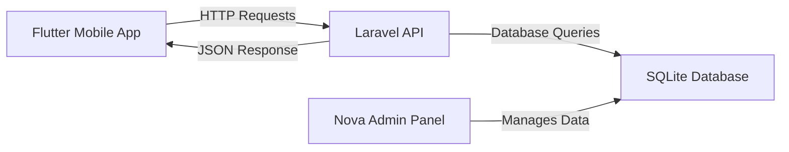

# XpertBot Pro - Executive Development Environment

## 🚀 Welcome to XpertBot Pro

**XpertBot Pro** is a comprehensive learning platform designed specifically for managers and C-level executives to understand modern web and mobile development technologies. Learn the fundamentals of backend APIs, mobile app development, and how they work together - all without installing anything on your computer.

---

## 🎯 What You'll Learn

### **Week 1: Foundation Concepts**
- **Git**: Version control and collaboration
- **JSON**: Data format and structure  
- **APIs**: How applications communicate
- **Postman**: API testing and documentation

### **Week 2: Backend Development**
- **Backend Development**: Server-side logic and architecture
- **Databases**: Data storage and relationships
- **API Development**: Building and testing APIs
- **Admin Panels**: Data management interfaces (Nova optional)

### **Week 3: Mobile Development**
- **Flutter**: Cross-platform mobile development
- **Layouts**: Building responsive user interfaces
- **MVC Pattern**: Code organization and architecture
- **Dio Client**: API integration in mobile apps
- **Shared Preferences**: Local data storage

### **Week 4: Hands-On Practice**
- **Practice 1**: Build a complete backend API with Claude
- **Practice 2**: Create a mobile app that connects to your API
- **Integration**: See your full-stack application in action

---

## 🌟 Getting Started

### **Step 1: Launch Your Environment**
Click the button below to start your personal development environment:

[](https://codespaces.new/your-username/xpertbot-pro-template)

> **⏱️ Setup Time**: 3-5 minutes for automatic configuration

### **Step 2: Access Your Applications**

Once setup is complete, you'll receive URLs for:

- **📱 Flutter Mobile App**: Your mobile application preview
- **🔧 Laravel API**: Backend API endpoints  
- **⚡ Laravel Nova Admin**: Database management interface
- **💻 VS Code Editor**: Your development environment

### **Step 3: Start Learning**

Follow the guided tutorials and see real-time changes as you modify code!

---

## 🛠️ Pre-Configured Environment

Your environment comes ready with:

### **Laravel Backend API**
- ✅ Complete Laravel installation with Nova admin panel
- ✅ Sample database with Users, Products, and Orders
- ✅ RESTful API endpoints ready for testing
- ✅ Authentication system configured
- ✅ CORS enabled for mobile app communication

### **Flutter Mobile Application**
- ✅ Cross-platform Flutter app (runs on web, iOS, Android)
- ✅ Pre-built screens: Login, Dashboard, Product List
- ✅ API service layer configured
- ✅ State management setup
- ✅ Navigation system implemented

### **Development Tools**
- ✅ VS Code with all necessary extensions
- ✅ Git version control
- ✅ Claude AI integration for code assistance
- ✅ Postman-like API testing capabilities
- ✅ Live reload for instant feedback

---

## 📋 Quick Start Checklist

After your Codespace launches:

- [ ] **Check Laravel API**: Visit `/api/products` to see the API response
- [ ] **Test Flutter App**: Open the mobile app preview
- [ ] **Verify Communication**: Use the API to create products and see them in the app
- [ ] **Explore Code**: Browse the project structure in VS Code
- [ ] **Ask Claude**: Use AI assistance for any questions

---

## 🌐 Application URLs

Your applications will be available at automatically generated URLs:

```
🔧 Laravel API:
https://[your-codespace]-8000.app.github.dev/api

📱 Flutter Mobile App:
https://[your-codespace]-3000.app.github.dev

📊 Nova Admin (if installed):
https://[your-codespace]-8000.app.github.dev/nova
```

> **Note**: The actual URLs will be provided in your terminal once the environment starts.

---

## 💡 Learning Path

### **For Absolute Beginners**
1. Start with the **Laravel Nova admin panel**
2. Add some sample data (products, users)
3. Open the **Flutter mobile app**
4. See how data flows from backend to mobile

### **For Technical Managers**
1. Explore the **API endpoints** in VS Code
2. Test APIs using the built-in terminal
3. Modify Flutter screens and see instant updates
4. Understand the **MVC architecture**

### **For C-Level Executives**
1. Focus on the **business value** of each technology
2. Understand **development timelines** and **resource requirements**
3. See how **team collaboration** works with modern tools
4. Learn to **communicate effectively** with technical teams

---

## 🔗 How Flutter Communicates with Laravel



**Real Example:**
1. **Nova Admin**: Create a new product
2. **Laravel API**: Stores in database, provides endpoint
3. **Flutter App**: Fetches data via API call
4. **Mobile Screen**: Displays the new product instantly

---

## 🎓 Learning Outcomes

By the end of XpertBot Pro, you will:

- ✅ **Understand** how modern web applications are built
- ✅ **Communicate effectively** with development teams
- ✅ **Make informed decisions** about technology choices
- ✅ **Estimate** development time and resources accurately
- ✅ **Lead technical projects** with confidence

---

## 🆘 Need Help?

### **Quick Fixes**
- **Environment not loading?** Wait 5 minutes, then refresh
- **URLs not working?** Check the terminal for correct addresses
- **Code not updating?** Save files and wait for auto-reload

### **Learning Support**
- **Ask Claude**: Type questions directly in the VS Code terminal
- **Explore Code**: All code is commented and beginner-friendly
- **Experiment**: Can't break anything - just restart the Codespace!

### **Technical Issues**
- **GitHub Codespaces Docs**: [https://docs.github.com/codespaces](https://docs.github.com/codespaces)
- **Support**: Contact your XpertBot Pro administrator

---

## 🏗️ Project Structure

```
xpertbot-pro-template/
├── 📁 laravel-api/          # Backend API with Nova admin
│   ├── app/Http/Controllers/API/    # API endpoints
│   ├── app/Models/                  # Database models
│   └── routes/api.php              # API routes
├── 📁 flutter-app/          # Mobile application
│   ├── lib/models/                 # Data models
│   ├── lib/services/               # API communication
│   ├── lib/screens/                # UI screens
│   └── lib/widgets/                # Reusable components
├── 📁 .devcontainer/        # Environment configuration
└── 📄 README.md            # This file
```

---

## 🚀 Ready to Start?

Click the **"Open in Codespaces"** button above and begin your journey into modern software development!

**Remember**: This is a learning environment designed for executives. Focus on understanding concepts rather than memorizing code. Your goal is to become a more effective technology leader.

---

## 📈 Success Metrics

Track your progress:

- [ ] **Week 1**: Successfully navigate Nova admin and understand API basics
- [ ] **Week 2**: Create and test API endpoints
- [ ] **Week 3**: Modify Flutter screens and understand mobile development
- [ ] **Week 4**: Build a complete feature from backend to mobile

**Final Goal**: Lead technical discussions with confidence and make informed technology decisions for your organization.

---

*Welcome to the future of executive technical education! 🎉*
